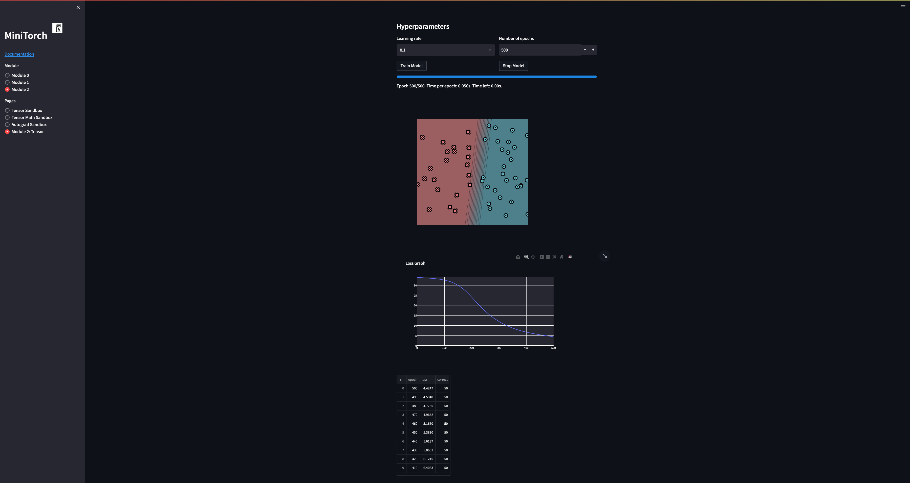
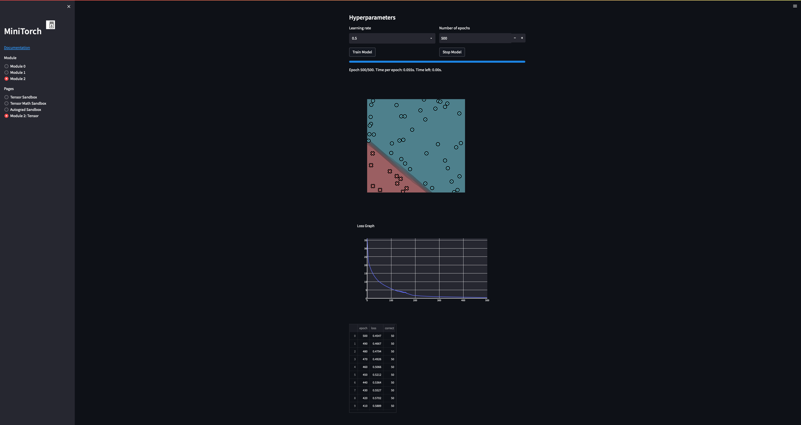
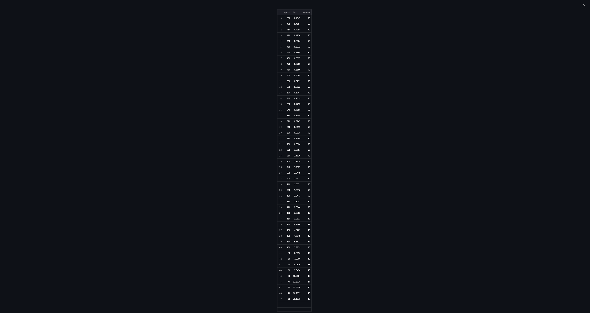
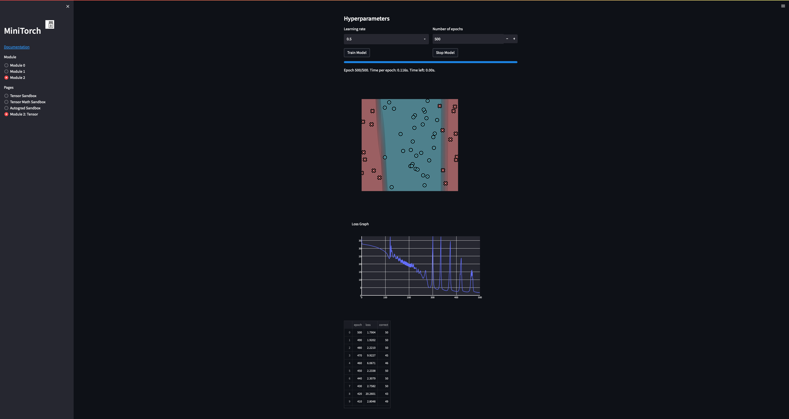
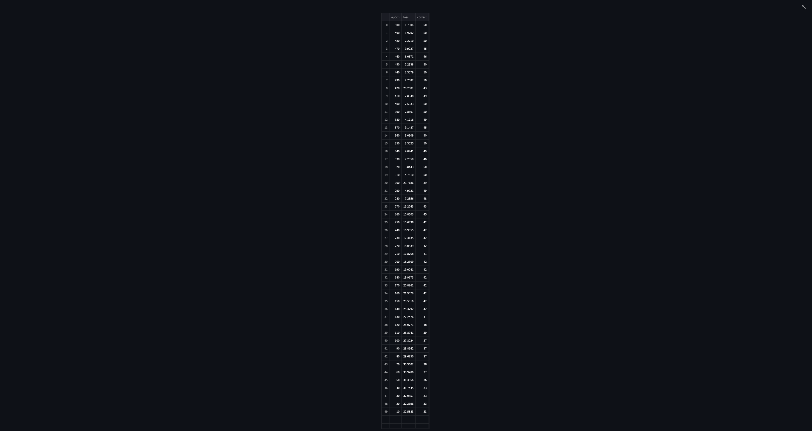

[](https://classroom.github.com/a/YFgwt0yY)
# MiniTorch Module 2


* Docs: https://minitorch.github.io/

* Overview: https://minitorch.github.io/module2/module2/

This assignment requires the following files from the previous assignments. You can get these by running

```bash
python sync_previous_module.py previous-module-dir current-module-dir
```

The files that will be synced are:

        minitorch/operators.py minitorch/module.py minitorch/autodiff.py minitorch/scalar.py minitorch/scalar_functions.py minitorch/module.py project/run_manual.py project/run_scalar.py project/datasets.py

Task 2.5

SIMPLE


```markdown
| Epoch | Loss  | Correct |
|-------|-------|---------|
| 0     | 4.4247| 50      |
| 1     | 4.5940| 50      |
| 2     | 4.7735| 50      |
| 3     | 4.9642| 50      |
| 4     | 5.1670| 50      |
| 5     | 5.3830| 50      |
| 6     | 5.6137| 50      |
| 7     | 5.8603| 50      |
| 8     | 6.1245| 50      |
| 9     | 6.4083| 50      |
| 10    | 6.7137| 50      |
| 11    | 7.0432| 50      |
| 12    | 7.4017| 50      |
| 13    | 7.8044| 50      |
| 14    | 8.2548| 50      |
| 15    | 8.7602| 50      |
| 16    | 9.3101| 50      |
| 17    | 9.9080| 49      |
| 18    | 10.5572| 49      |
| 19    | 11.2604| 49      |
| 20    | 12.0360| 48      |
| 21    | 12.9043| 48      |
| 22    | 13.8333| 48      |
| 23    | 14.8432| 46      |
| 24    | 15.9767| 45      |
| 25    | 17.1996| 44      |
| 26    | 18.4631| 42      |
| 27    | 19.8551| 42      |
| 28    | 21.2865| 41      |
| 29    | 22.7856| 39      |
| 30    | 24.2520| 37      |
| 31    | 25.6668| 35      |
| 32    | 26.9918| 33      |
| 33    | 28.1591| 29      |
| 34    | 29.1804| 29      |
| 35    | 30.0660| 29      |
| 36    | 30.8035| 29      |
| 37    | 31.4080| 29      |
| 38    | 31.8946| 29      |
| 39    | 32.2878| 29      |
| 40    | 32.6043| 29      |
| 41    | 32.8599| 29      |
| 42    | 33.0706| 29      |
| 43    | 33.2433| 29      |
| 44    | 33.3850| 29      |
| 45    | 33.5011| 29      |
| 46    | 33.5979| 29      |
| 47    | 33.6823| 29      |
| 48    | 33.7620| 29      |
| 49    | 33.8400| 29      |
```
DIAG



SPLIT



XOR

